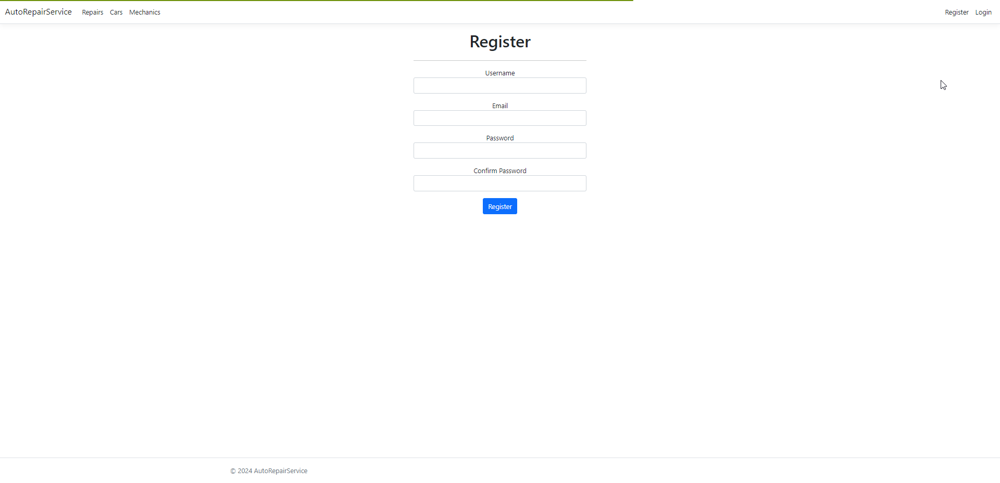

AutoRepairService-ASP.NET-Project-002

# AutoRepairService

## Introduction
AutoRepairService is application for creating/accepting repairs requests and for buying AutoRepairService car.

## Features
- Google Maps with Econt offices in the cart view
- Live Support chat added for support user/admin

### User Roles
- **Customer**: Upon registration, can Add, Edit, Access All repairs, View My repairs, Accept/Decline offers, Search, Use Live support Chat, View their orders, Buy car, Rate the mechanic with stars
- **Mechanic**: customer can become mechanic from mechanics/Join Our mechanics button, can send offers for repairs
- **Admin**: Seeded, access Admin page, Add/Edit repairs, Add/Edit/Delete cars, Accept/Decline repairs, Complete Orders, View repairs statistics, Reply to Message Requests Live Support Chat

## Role Details:

### customer Role
- Customers can Add repairs  
- The repair is sent for admin review and can be accepted or declined.  
- Customer can Edit repair before it is Accepted from the Admin  
- If the repair is Taken or Accepted it can not be deleted  
- Receive offers  
- Customer can receive offer for his repair(repairs/My repair Offers - one offer from mechanic)  
- Offers can be accepted or declined:  
- If offer is accepted the current repair is marked as "Taken"
- When the repair is completed customer can mark the repair as "Completed" from repairs/My repairs and rate the mechanic.  
- Search cars  
- cars can be added to user's cart where quantity is selected, address is required to submit the order. From the menu button the user can review his order status.  
- Rate the mechanic with stars after repair completed

### Mechanic Role
- Customer can become mechanic from mechanics/Join Our mechanics button  
- Mechanics can send offers for all available repairs in the repairs menu  
- Mechanic can Search cars  
- cars can be added to user's cart where quantity is selected, address is required to submit the order. From the menu button the user can review his order status.

### Admin Role
- Can access Administration page:  
- Add/Edit repairs in All repairs
- Accept/Decline repairs in Admin area 
- Add/Edit/Delete cars
- Review Orders and mark them as Completed  
- View repairs statistics
- Reply to Message Requests

## Roles logins:
- Customer: `username: customer`, `password: customer`
- Mechanic: `username: mechanic`, `password: mechanic`
- Admin: `username: admin`, `password: admin`

## How to use?
- 0.Download the repository and extract it to folder
- 1.Open AutoRepairService.sln with visual studio 2022
- 2.In appsetting.json add your personal "ConnectionStrings"
- 3.right click on AutoRepairService Project and "Set as Startup Project"
- 4.In "Package Manager Console" with Default project: "AutoRepairService.Infastructure" type: update database
- 5.Ctrl+F5
- 6.Open Url localhost on your browser: https://localhost:7160/
- 7.Enjoy!

## Used libraries:
    - `SignalR` - for realtime live chat
    - `Pace`, - for page load progress bars
    - `Toastr` - for notifications 
    - `jQuery` - simplifying html and css
    - `bootstrap` - CSS Framework

## Database

SSMS and MS SQL are used for storing & managing the data.

## Tests

- `Unit Tests`

## Demo
Live demo at Replit -

## Photos

Home page with the last 3 cars added:

 

Live Chat Support between customer and admin:

Cart with Google Maps and Econt offices:

Car shop:

 

Customer can Rate with 1/5 stars The mechanic:

 

Add repair request:

 

My Created repairs:

 

Accept or Decline offers:

 

My Orders:

 

Register:

 

Mechanic can send offers:

 

Admin can add car:

 

Admin can edit/delete car:

 

Admin can View All Orders and Mark as Complete any Order:

 

Admin can View repair Statistics:

 
